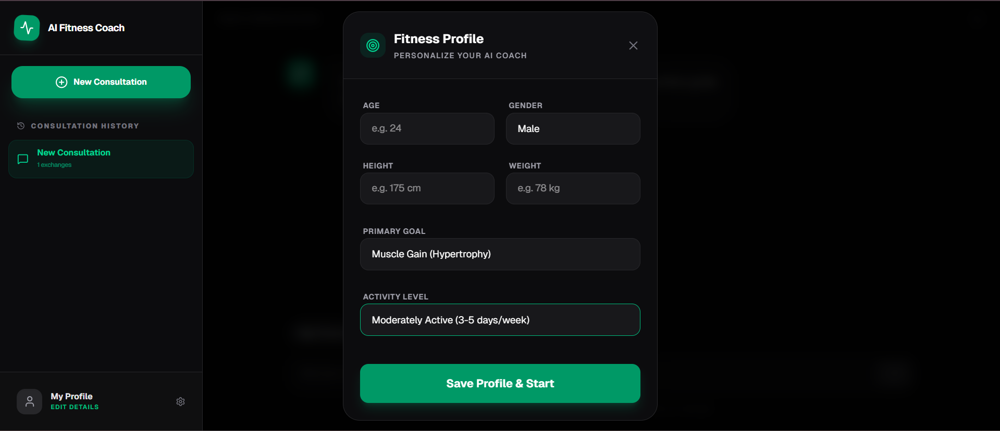
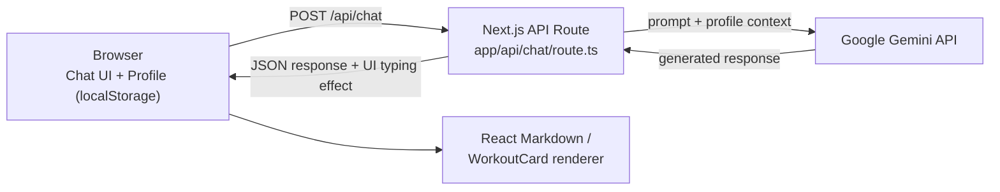

<a name="readme-top"></a>
<div align="center">
    
# 🏋️ AI Fitness Coach

### An intelligent AI-powered fitness and nutrition assistant that generates personalized workout plans, diet suggestions, and real-time coaching guidance.

<br/>

[](https://fitness-nutrition-chatbot.vercel.app)

<br/>


**[📸 Preview](#-preview)** · **[⚡ Features](#-features)** · **[🛠 Tech Stack](#-tech-stack)** · **[🚀 Get Started](#-local-development)**

</div>

---

## 📑 Table of Contents

- [Preview](#-preview)
- [Features](#-features)
- [Tech Stack](#-tech-stack)
- [Architecture](#️-architecture)
- [Project Structure](#-project-structure)
- [Local Development](#-local-development)
- [AI Capabilities](#-ai-capabilities)
- [Project Purpose](#-project-purpose)
- [Future Improvements](#-future-improvements)
- [Disclaimer](#️-disclaimer)
- [Author](#-author)

---


## 📸 Preview

<div align="center">

**🧍 Fitness Profile Setup**



Age, height, weight, gender, goal, and activity level — feeds every AI recommendation

**💬 Chat Interface**


Responsive AI chat for fitness and nutrition questions

**💪 Workout Plan Generation**


AI-generated plans render as structured visual cards, not plain text — sets and reps laid out like a real fitness app, not a generic chatbot reply.

</div>

<p align="right"><a href="#readme-top">back to top ⬆️</a></p>

---

## ⚡ Features

### 🧠 Personalized AI Fitness Coaching

The AI coach answers a wide range of fitness and nutrition queries, including:

- **Personalized workout plans** tailored to your goal and fitness level
- **Fat loss strategies** and caloric guidance
- **Muscle gain programs** with progressive overload principles
- **Nutrition recommendations** and macro calculations
- **Training schedule planning** and recovery guidance

All responses are informed by the user's stored fitness profile for maximum relevance.

---

### 🧍 User Fitness Profile Memory

Users can store and save their personal fitness data:

| Field | Description |
|---|---|
| Age | Used to calibrate intensity and recovery |
| Height & Weight | For BMI and caloric calculations |
| Gender | Influences hormonal and physiological recommendations |
| Fitness Goal | Fat loss / Muscle gain / Maintenance |
| Activity Level | Sedentary to Very Active |

This information is automatically injected into every AI request to generate **truly personalized recommendations**.

The profile also supports preferred units, experience level, available equipment, weekly schedule, dietary preferences, and injury or limitation notes.

---

### 💪 Workout Plan UI Cards

AI-generated workout plans are parsed and rendered as **structured visual workout cards** instead of raw Markdown text.

```
Day 1 — Chest & Triceps        Day 2 — Back & Biceps
──────────────────────         ──────────────────────
✔ Bench Press       4×10       ✔ Pull Ups           4×8
✔ Incline DB Press  3×12       ✔ Lat Pulldown       3×12
✔ Chest Fly         3×15       ✔ Barbell Deadlift   3×8
✔ Tricep Pushdown   3×12       ✔ Hammer Curls       3×12
```

This makes the UI feel like a **dedicated fitness application** rather than a generic chatbot.

---

### ⚡ Responsive AI Responses

Responses are displayed with a responsive typing effect after the Gemini response is received, making the experience feel immediate and readable.

This dramatically improves the feel of the application, making it responsive and interactive rather than waiting for a full response to load.

---

### 🗂 Multi-Session Chat Management

Users can manage multiple independent consultation sessions:

- **Create** new consultation sessions
- **Switch** between existing sessions seamlessly
- **Delete** individual chat histories

Session data is stored persistently in **localStorage** — no backend database required.

The chat also supports copying assistant responses, regenerating the latest answer, and retrying failed requests without manually re-entering the question.

---

### 📝 Markdown Rendering

The chatbot fully supports formatted AI responses including:

- Headings and subheadings
- Bullet points and numbered lists
- Structured workout and diet plans
- Bold and italic emphasis

This ensures AI answers are **clean, readable, and well-organized** — not walls of plain text.

### 📈 Saved Plans and Progress Tracking

- Save useful coach responses for later reference.
- Log workouts, weight, water, sleep, and notes in the Progress dashboard.
- Keep this tracking data private in the browser during the current no-account phase.

<p align="right"><a href="#readme-top">back to top ⬆️</a></p>

---

## 🛠 Tech Stack

### Frontend

| Technology | Purpose |
|:---:|:---|
|  | App Router — Full-stack React framework |
|  | UI component library |
|  | Utility-first styling |
|  | Formatted response rendering |
|  | Icon library |

### Backend

| Technology | Purpose |
|:---:|:---|
|  | Serverless backend handlers |
|  | Core AI model integration |

### Deployment

| Technology | Purpose |
|:---:|:---|
|  | Hosting and CI/CD pipeline directly from GitHub |

<p align="right"><a href="#readme-top">back to top ⬆️</a></p>

---
## 🏗️ Architecture



There's no separate backend or database — the Next.js API route calls Gemini directly on each message and injects the saved fitness profile as context. Session and profile data live entirely in the browser's `localStorage`, with defensive parsing for corrupted or outdated stored data.

<p align="right"><a href="#readme-top">back to top ⬆️</a></p>

---

## 📂 Project Structure

```
app/
├── api/
│   └── chat/
│       └── route.ts          # AI backend route — Gemini API integration
└── page.tsx                  # Main chatbot UI

screenshots/                   # Preview images used in this README
```

<p align="right"><a href="#readme-top">back to top ⬆️</a></p>

---

## 🚀 Local Development

**1. Clone the repository**
```bash
git clone https://github.com/yashrajagawane/Fitness-Nutrition-Chatbot.git
cd Fitness-Nutrition-Chatbot
```

**2. Install dependencies**
```bash
npm install
```

**3. Configure environment variables**

Create a `.env.local` file in the root directory:
```env
GEMINI_API_KEY=your_gemini_api_key_here
```

Get your API key from [Google AI Studio](https://aistudio.google.com).

**4. Start the development server**
```bash
npm run dev
```

Run the full local verification suite before opening a pull request:
```bash
npm run verify
```

Open [http://localhost:3000](http://localhost:3000) in your browser.

<p align="right"><a href="#readme-top">back to top ⬆️</a></p>

---

## 🧠 AI Capabilities

The AI fitness coach is capable of providing guidance on:

- ✅ Personalized multi-day workout programs
- ✅ Diet and meal recommendations
- ✅ Fat loss and calorie deficit strategies
- ✅ Muscle building and hypertrophy training
- ✅ Recovery and rest day planning
- ✅ Macro and micronutrient breakdown
- ✅ Fitness goal planning and progress advice

All responses are structured to resemble **professional fitness coaching advice** — not generic AI output.

<p align="right"><a href="#readme-top">back to top ⬆️</a></p>

---

## 🎯 Project Purpose

This project demonstrates how to build a **production-grade AI-powered web application** using modern full-stack technologies. Key concepts covered:

- Conversational UI design with chat session management
- AI model integration via serverless API routes
- Responsive response presentation for better UX
- Structured data rendering from AI output (workout cards)
- User profile context injection into AI prompts

It serves as a **portfolio-level project** that showcases practical AI integration, thoughtful UI/UX design, and full-stack engineering skills.

<p align="right"><a href="#readme-top">back to top ⬆️</a></p>

---

## 📈 Future Improvements

- [ ] User authentication and persistent accounts
- [ ] Saved and named workout programs
- [ ] Progress tracking with charts and analytics
- [ ] AI-generated weekly meal plans with calorie breakdown
- [ ] Mobile-first responsive redesign
- [ ] Push notifications for workout reminders

<p align="right"><a href="#readme-top">back to top ⬆️</a></p>

---

## ⚠️ Disclaimer

This project provides general, AI-generated fitness and nutrition information for educational and portfolio purposes. It is **not a substitute for advice from a certified personal trainer, registered dietitian, or physician**. Consult a qualified professional before starting any new workout or diet program, especially if you have an existing health condition or injury.

<p align="right"><a href="#readme-top">back to top ⬆️</a></p>

---

## 👨‍💻 Author

**Yashraj Agawane**

[](https://github.com/yashrajagawane)

<p align="right"><a href="#readme-top">back to top ⬆️</a></p>

---

<div align="center">

**⭐ If you found this project useful, please consider starring the repository!**

</div>
