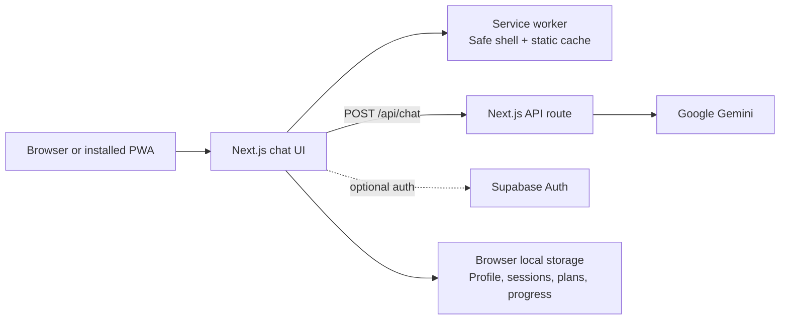

<a name="readme-top"></a>

<div align="center">

# 🏋️ AI Fitness Coach

### An AI-powered fitness and nutrition coach for the browser and your phone home screen.

[](https://fitness-nutrition-chatbot.vercel.app)


**[Preview](#-preview)** · **[Features](#-features)** · **[Setup](#-local-development)** · **[PWA guide](#-phone-pwa-experience)**

</div>

---

## 📸 Preview

<div align="center">

### Desktop chat workspace


### Fitness profile


### Structured workout plan


</div>

---

## ⚡ Features

### 🧠 AI fitness and nutrition coaching

- Personalized workout, nutrition, recovery, and macro guidance.
- Structured responses with summaries, action plans, and safety notes.
- Fitness-domain guardrails and an educational health disclaimer.
- Markdown rendering and structured workout cards for readable training plans.

### 📱 Phone-first PWA experience

- Works as a normal responsive website on desktop and mobile browsers.
- Installable as a Progressive Web App on supported Android browsers.
- iPhone and iPad users receive **Share → Add to Home Screen** guidance.
- Standalone app metadata, portrait orientation, theme colour, and app icons.
- Production service worker caches only safe application-shell and static assets.
- Offline fallback page for navigation when there is no connection.
- AI, authentication, Supabase, and API requests remain network-only.

### 🎛 Responsive mobile interface

- Hideable mobile sidebar with a dedicated sidebar-open button.
- Mobile header prevents chat-title overlap with the sidebar control.
- Phone-safe bottom spacing so the composer is not hidden by system UI.
- Touch-friendly send button and phone keyboard send hint.
- Scrollable profile and Progress & Plans dialogs.
- First-time visitors enter the dashboard directly; completing a profile is optional.

### 👤 Profile, authentication, and privacy

- Optional profile: age, height, weight, goal, activity, equipment, schedule, diet preferences, and limitations.
- Saved profile details are included in the AI context for more relevant responses.
- Simple Supabase email sign-up, sign-in, and sign-out flow when configured.
- Browser storage keeps sessions, profiles, plans, and progress private by default.
- Export/import JSON backup and delete local data controls.

### 🗂 Consultations, plans, and progress

- Create, switch, and delete consultation sessions.
- Save useful coach responses as plans.
- Share saved plans with the native phone share sheet, with clipboard fallback.
- Log workouts, weight, water, sleep, and notes in Progress & Plans.
- Copy responses, regenerate the latest answer, and retry failed messages.

### 🛡 Reliability

- Request validation, rate limiting, request IDs, no-store API responses, and a health endpoint.
- Automated PWA readiness checks validate manifest, icons, offline fallback, and service-worker safety boundaries.

---

## 🛠 Tech stack

| Technology | Purpose |
| --- | --- |
| Next.js 16 + App Router | Full-stack React application and API routes |
| React 19 | Interactive UI |
| Tailwind CSS | Responsive styling |
| Google Gemini | AI coaching responses |
| Supabase | Optional email authentication |
| React Markdown + Lucide | Rich responses and UI icons |
| Service Worker + Web Manifest | Installable PWA and offline fallback |
| Vercel | Deployment and CI/CD |

---

## 🏗️ Architecture



The service worker does not cache Gemini, Supabase, authentication, or API requests. This keeps private and live data network-only while still allowing a useful offline app shell.

---

## 📂 Project structure

```text
app/
├── api/
│   ├── chat/                 # Gemini-backed coaching endpoint
│   └── health/               # Deployment health endpoint
├── components/               # PWA registration and install UI
├── lib/                      # Storage, validation, Supabase helpers
├── offline/                  # Offline fallback route
├── layout.tsx                # Metadata, manifest, PWA wiring
├── manifest.webmanifest      # Install metadata
└── page.tsx                  # Main application UI

public/
├── icons/                    # PWA icons
└── sw.js                     # Safe service worker

scripts/
├── health-check.mjs          # Deployment smoke check
└── verify-pwa.mjs            # PWA readiness check

screenshots/                  # README preview images
supabase/schema.sql           # Supabase database schema
```

---

## 🚀 Local development

### 1. Clone and install

```bash
git clone https://github.com/yashrajagawane/fitness-nutrition-chatbot.git
cd fitness-nutrition-chatbot
npm install
```

### 2. Configure environment variables

Create `.env.local` in the project root:

```env
GEMINI_API_KEY=your_google_gemini_api_key

# Optional: enables Supabase email authentication
NEXT_PUBLIC_SUPABASE_URL=https://your-project.supabase.co
NEXT_PUBLIC_SUPABASE_PUBLISHABLE_KEY=your_supabase_publishable_key
```

Get a Gemini key from [Google AI Studio](https://aistudio.google.com). For Supabase authentication, create a project, add the two public values above, and run [`supabase/schema.sql`](supabase/schema.sql) in the Supabase SQL Editor.

### 3. Run the app

```bash
npm run dev
```

Open [http://localhost:3000](http://localhost:3000).

### 4. Verify before deployment

```bash
npm run verify
```

This runs the PWA readiness check, ESLint, TypeScript typecheck, and production build.

### 5. Optional deployment smoke check

```bash
DEPLOYMENT_URL=https://your-deployment.vercel.app npm run smoke
```

---

## 📲 Phone PWA experience

### Android

When the browser offers installation, use the in-app **Install app** prompt. It may not appear immediately because browser installation rules apply; it also stays hidden after dismissal or when the app is already installed.

### iPhone and iPad

Open the app in Safari, tap **Share**, then choose **Add to Home Screen**. The app displays this guidance automatically on eligible iOS and iPadOS browsers.

### Offline behaviour

The application shell and static assets can load from the PWA cache. AI coaching, sign-in, Supabase, and data requests still require a connection and are not cached.

---

## ✅ Quality checks

- `npm run pwa:verify` validates required PWA files, manifest metadata, offline fallback wiring, and API-cache bypass.
- `npm run lint` checks code quality.
- `npm run typecheck` checks TypeScript.
- `npm run build` validates the production application.
- `npm run verify` runs all checks in order.

---

## 📈 Future improvements

- [ ] Sync profiles, saved plans, and progress entries to Supabase per signed-in user.
- [ ] Add ownership checks for cloud-synced data.
- [ ] Add reminders and optional push notifications.
- [ ] Add progress charts and long-term analytics.
- [ ] Complete real-device checks for installation, offline fallback, sharing, and authentication.

---

## ⚠️ Disclaimer

AI Fitness Coach provides general, AI-generated fitness and nutrition education. It is not medical advice and does not replace a certified trainer, registered dietitian, or physician. Consult a qualified professional before beginning a new workout or diet plan, especially if you have an injury, medical condition, or dietary concern.

---

## 👨‍💻 Author

**Yashraj Agawane**

[](https://github.com/yashrajagawane)

<p align="right"><a href="#readme-top">back to top ⬆️</a></p>
